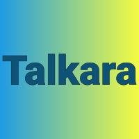

  

<h1 align="center">Talkara</h1>

  Multi-room live chat using <strong>Astro SSR + HTMX + SSE + Postgres + Drizzle</strong>, styled with <strong>Tailwind CSS</strong>.

## Themes

Talkara ships with two switchable themes derived from the logo colour palette:

| Theme | Description |
|-------|-------------|
| **talkara_classic** | Dark navy backgrounds with bright blue accents and yellow-green highlights — the default. |
| **talkara_light** | Light, airy backgrounds with the same brand blue and a contrast-safe dark gold accent. |

Toggle between them using the sun/moon button in the page header (or top-right on login screens). The choice is saved to `localStorage` and respected on reload. First-time visitors get the theme matching their OS `prefers-color-scheme` setting.

## Requirements

- Node.js (see `package.json` engines)
- Docker + Docker Compose (recommended for Postgres)

## Setup

From the `Talkara/` directory:

1. Start Postgres:
   - `docker compose up -d`

2. Configure environment:
   - `cp .env.example .env`

3. Install dependencies:
   - `npm install`

4. Run DB migrations:
   - `npm run db:migrate`

5. Run the app:
   - `npm run dev`

Astro dev server runs at `http://localhost:4321` by default.

## Useful scripts

- `npm run db:generate` — generate SQL migrations from `src/db/schema.ts`
- `npm run db:migrate` — apply migrations to the configured `DATABASE_URL`

## Features

- **Multi-room chat** — Create rooms, join any room, and chat in real-time
- **Live presence** — See who's online in each room with green status indicators
- **Typing indicators** — Know when someone is typing
- **Theme switching** — Toggle between talkara_classic (dark) and talkara_light themes
- **Logout** — Click Logout in the header to return to the nickname picker
- **Delete rooms** — Delete any room (except Lobby) from the room header
- **Auto-focus input** — Chat input is automatically focused when joining a room
- **Responsive layout** — Works on desktop, tablet, and mobile with adaptive sidebars

## Project log

See `PROJECT_HISTORY.md` for a phase-by-phase record of what was built and why.
