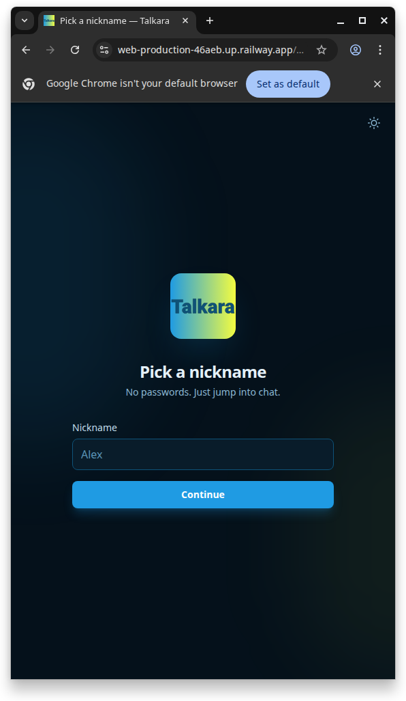
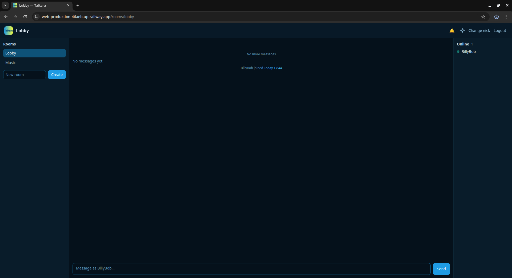
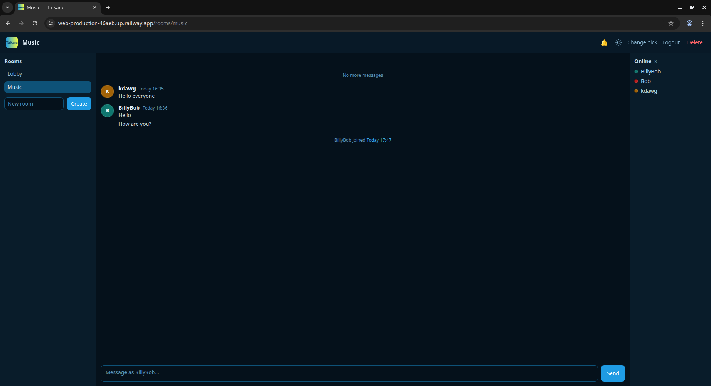
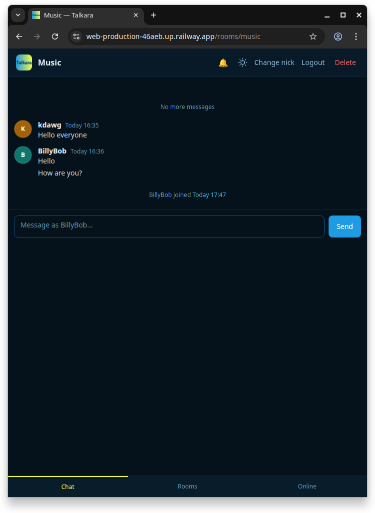
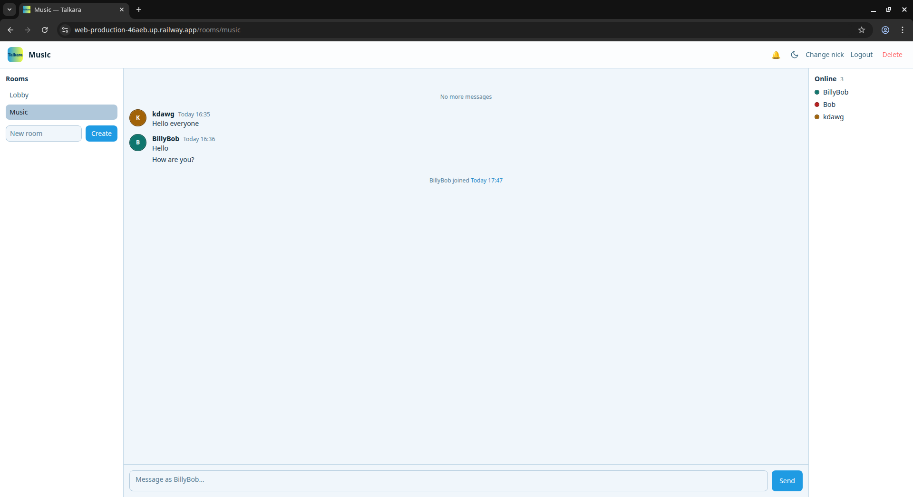

<p align="center">
  
</p>

<h1 align="center">Talkara</h1>

<p align="center"><strong>Multi-room live chat</strong> — pick a nickname, join the lobby, create rooms, and talk in real time with presence, typing hints, and @mentions.</p>

## Overview

Talkara is a browser-based chat app: server-rendered pages, live updates over **Server-Sent Events (SSE)**, and messages stored in **PostgreSQL**. The UI is responsive (desktop columns, mobile tabs) and supports **dark and light** themes.

### Tech stack

| Layer | Technology |
|--------|------------|
| **Framework** | [Astro](https://astro.build) 6 (SSR) |
| **Runtime** | [Node.js](https://nodejs.org) — `@astrojs/node` standalone adapter |
| **Interactivity** | [HTMX](https://htmx.org) + [htmx-ext-sse](https://github.com/bigskysoftware/htmx-extensions/blob/main/src/sse/README.md) |
| **Styling** | [Tailwind CSS](https://tailwindcss.com) v4 (`@theme` tokens) |
| **Database** | [PostgreSQL](https://www.postgresql.org) + [Drizzle ORM](https://orm.drizzle.team) |
| **Deploy (example)** | [Railway](https://railway.app) — see **[RAILWAY_SETUP.md](./RAILWAY_SETUP.md)** |

## Screenshots

Captures are in **`public/Screenprints/`** — filenames indicate **theme** (`Talkara_dark` / `Talkara_light`), **screen** (login, lobby, room, online), and **layout** (fullsize, tablet, mobile, selection).

<p align="center">
  <br />
  <em>Login / nickname — dark theme</em>
</p>

<p align="center">
  <br />
  <em>Lobby — dark theme, full-width</em>
</p>

<p align="center">
  <br />
  <em>Room — dark theme, desktop (rooms, chat, online)</em>
</p>

<p align="center">
  <br />
  <em>Room — dark theme, mobile</em>
</p>

<p align="center">
  <br />
  <em>Room — light theme, desktop (compare with dark above)</em>
</p>

## Features

- **Multi-room chat** — Lobby plus user-created rooms; room list can refresh live when rooms change.
- **Real-time messaging** — New messages appear without full page reload (SSE + HTMX).
- **Scrollback** — Load older messages when you scroll to the top of the thread.
- **Presence** — See who is online in the current room (with per-user avatar colours).
- **Typing indicators** — See when others are typing.
- **@mentions** — Type `@` to pick online users or `@everyone`; mentions are highlighted; optional browser notifications (bell in header).
- **Avatar colours** — Consistent colours for avatars and presence dots (session-based when online, hash fallback when not).
- **Grouped messages** — Consecutive lines from the same user are visually grouped.
- **Themes** — **talkara_classic** (dark) and **talkara_light**; toggle in header / login screens; stored in `localStorage`.
- **Account** — Change nickname, logout; **delete room** (except Lobby) from the room header.
- **Responsive layout** — Wide screens: rooms + chat + online; narrow: tabbed panels; header can stack on small widths.

## Themes

| Theme | Description |
|-------|-------------|
| **talkara_classic** | Dark navy backgrounds, blue accents, yellow-green highlights (default). |
| **talkara_light** | Light surfaces, same brand blue, contrast-safe gold accent. |

Toggle with the sun/moon control. First visit can follow `prefers-color-scheme`.

## Build & run (local)

**Requirements:** Node.js (see `package.json` → `engines`), Docker (for Postgres).

```bash
cd Talkara
docker compose up -d          # Postgres
cp .env.example .env          # set DATABASE_URL if needed
npm install
npm run db:migrate
npm run dev
```

Dev server: **http://localhost:4321**

**Production-style build:**

```bash
npm run build
npm start                     # migrates DB, then serves ./dist/server/entry.mjs
```

| Script | Purpose |
|--------|---------|
| `npm run dev` | Astro dev server |
| `npm run build` | Production SSR build → `dist/` |
| `npm start` | `drizzle-kit migrate` + Node standalone server (`PORT` / `HOST` from env) |
| `npm run db:migrate` / `npm run db:generate` | Drizzle migrations |

## Deploy on Railway

See **[RAILWAY_SETUP.md](./RAILWAY_SETUP.md)** for Postgres, web service, `DATABASE_URL`, Docker build, and troubleshooting.

## Developer notes

- **`GET /rooms/:slug/online-names`** — JSON `{ "names": string[] }` for online nicknames (mention autocomplete). Requires session cookie.
- Message bodies render `@tokens` via `src/server/render.ts` (`renderBodyWithMentions`).

## Project history

Chronological development log: **[PROJECT_HISTORY.md](./PROJECT_HISTORY.md)**
